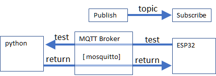

# MQTTテスト
MQTTを用いてpythonとESP32で通信するサンプルを確認。

# 動作環境 

## ハーウェア


+ PC

 Pythonコードを実行する環境。
Windows環境にMQTTブローカーを導入することも可能だが、ファイアウォールの影響かうまく通信できない。
また、ESP32の開発用にArduinoを準備する。

+ Linuxマシン

MQTTブローカーを起動しておくサーバ機。RaspberryPiでも良いが、Macは不明。
Linuxマシンの以下の情報を準備する。

|変数名| 名称 | 例 | 詳細 |
|---|----|-----|-----|
| mqttHost | IPアドレス | 192.168.XX.YY | MQTTブローカの接続先アドレス |
| mqttPort | ポート| 1883 | MQTTブローカ(mosquitto)のポート番号|


+ ESP32

どこのご家庭にもある、安価にWIFI通信が可能なマイコンモジュール。今回はリチウムポリマー充電器がついている「[Adafruit HUZZAH32](https://eleshop.jp/shop/g/gJ25317/)」を用いた。

+ Wifiルータ

ESP32の仕様上、2.4GHz帯(11b/g)が利用できる設定を行っておく。
Ubuntuマシン及びPCは、有線/無線(2.4GHz/5Hz)のいずれかで接続する。以下の情報を準備する

|変数名|  詳細 |
|---|-----|
| essid | ESP32のWIFI接続先のESS-ID |
| pass  |ESS-IDの接続パスワード|

## ソフトウェアライブラリ

### [Mosquitto](https://mosquitto.org/)

MQTTブローカー。**Ubuntuマシン**に以下のコマンドでインストールする。

　mosuquitto を以下のコマンドでインストールする。なお、インストール後に自動でサービスが起動する

```bash
$ sudo apt-get install mosquitto
$ sudo apt-get install mosquitto-clients
```
### [paho_mqtt](https://github.com/eclipse/paho.mqtt.python)
python用のMQTTクライアント。
**PC**にインストールしておく。

### [pusubclient](https://github.com/knolleary/p[ubsubclient) 

Arduino用MQTTクライアントライブラリ。 Arduinoに追加しておくか、srcフォルダをinoファイルが入っているフォルダ内にコピーし、以下のincludeを修正する。
```
#include <PubSubClient.h>
```
↓
```
#include "src/PubSubClient.h"
```


## トピック

今回使用するトピックは以下の通り。

| トピック | 詳細 |　publish | subscribe | メッセージ
|---|---|---|---|---|
| test | ESP32が送信する情報 | ESP32 | Python | 'payload'
| return | Pyhonが返す応答値| Python | ESP32 | 'Hellow!' |

## 実行結果

Python側の実行例
```
Connect0
Recieve : b'payload'
Recieve : b'payload'
Recieve : b'payload'
Recieve : b'payload'
Recieve : b'payload'
Recieve : b'payload'
```

ESP32側の実行例(Serialの出力)
```
WiFi connecting>....
 connected. 192.168.XXX.***
Connecting to MQTT...
connected
Message arrived [return] Hellow!
Message arrived [return] Hellow!
Message arrived [return] Hellow!
Message arrived [return] Hellow!
Message arrived [return] Hellow!
Message arrived [return] Hellow!
Message arrived [return] Hellow!
```